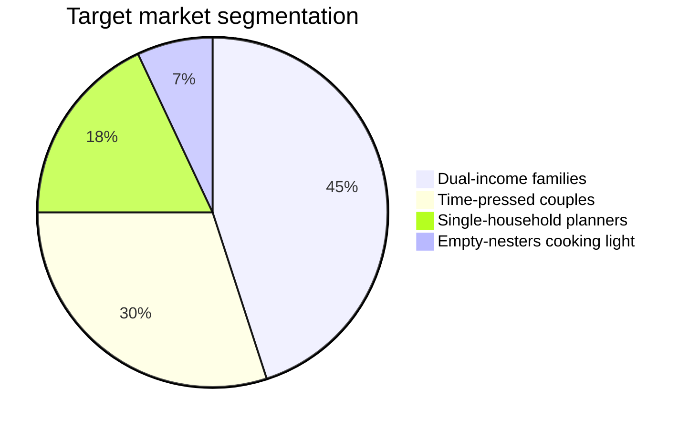

# Market and Customers

NestRoute serves households that cook at home most nights and feel the planning tax every week. They are not looking for gourmet ambition — they want the default question answered well, cheaply, and on time.

## Who we serve

- **Dual-income families.** Two working adults, one or two kids, no slack in the weeknight schedule. The plan-shop-prep loop is the whole pitch.
- **Couples optimizing time and money.** Cook most nights, hate food waste, want a single list that fits a real budget.
- **Single-household planners.** Cook for one or two, struggle with portioning and repetition more than with effort.

Here is how we expect the early subscriber base to break down across those groups:

To make the two biggest groups concrete, here are the personas we design and write copy for:

<!-- otion:columns {"count":2} -->

**The Tuesday-night family.** Two parents, two kids, both working. They open the app at 6pm with no plan and twenty minutes. They want one balanced week, one list, and zero arguments about what's for dinner.

**The budget-minded couple.** No kids, two incomes, a strong distaste for waste. They cook five nights a week and care most about a single tidy list that respects a weekly grocery budget and reuses what's already in the pantry.

## Why they pay

<!-- otion:info {"color":"green","icon":"HeartHandshake","text":"The job isn't \"give me recipes\" — recipes are free everywhere. The job is **make the weekly decision and logistics disappear**. People pay 12 USD/mo for the same reason they pay for any small subscription that quietly removes a recurring chore."} -->

## Market sizing, stated plainly

We don't need a huge slice to build a real business. Tens of millions of households cook at home regularly in our launch markets. Converting a small fraction to a 12 USD/mo habit, at 85% gross margin, compounds into meaningful recurring revenue — and the model on the [Pricing and Growth Model](Business Plan.sub_pages/Pricing and Growth Model.md) page shows how even a 150-customer start grows month over month.

## Competition

- **Free recipe sites and notes apps.** Abundant, but they don't own the *decision* or the *list*. We win on doing the whole loop, not on having more recipes.
- **Big grocery and delivery apps.** Optimized to sell groceries, not to plan a balanced week within a budget. We're complementary, and a potential partner.
- **Other meal-planning apps.** Real competition. We differentiate on pantry awareness, prep routines, and a flat, honest price with no upsells.

## What would change the picture

- If churn ran hotter than 3%, retention work moves to the top of the roadmap.
- If CAC climbed above payback comfort, we'd lean harder on referrals and partnerships over paid acquisition.

Both levers live in the [Assumptions model](Business Plan.sub_pages/Pricing and Growth Model.md), so we can test either scenario in seconds.

<!-- otion:pageLink {"path":"Business Plan.sub_pages/Go-to-Market.md","title":"How we reach them"} -->
