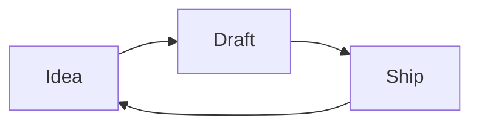

# Editing basics

Everything in Otion is a block. Type `/` on an empty line to see them all. The essentials:

## Text and structure

Plain paragraphs, three heading levels, **bold**, *italic*, `inline code`, and lists:

- Bullet lists with `-`

1. Numbered lists with `1.`

- [ ] Checklists with `- [ ]`
- [x] Done items with `- [x]`

> Quotes with `>` — good for things worth keeping.

## Callouts

<!-- otion:info {"color":"yellow","icon":"Lightbulb","text":"Callouts come in seven colors and take any icon or emoji. Use them sparingly and they keep their punch."} -->

## Math

Block equations render with LaTeX:

<!-- otion:math {"equation":"e^{i\\pi} + 1 = 0"} -->

## Diagrams

Fence a code block with `mermaid` and it renders as a diagram:



## Code

```python
def greet(name):
    return f"Hello, {name}!"
```

That's most of it. The rest you'll find in the `/` menu when you need it.
