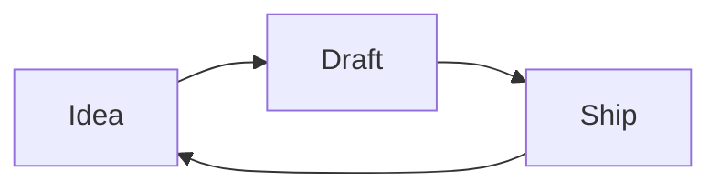

# Editing basics

Everything in Otion is a block. Type `/` on an empty line to see them all. The essentials:

## Text and structure

Plain paragraphs, three heading levels, **bold**, *italic*, `inline code`, and lists:

- Bullet lists with `-`

1. Numbered lists with `1.`

- [ ] Checklists with `- [ ]`
- [x] Done items with `- [x]`

> Quotes with `>` — good for things worth keeping.

## Callouts

<!-- otion:info {"color":"yellow","icon":"Lightbulb","text":"Callouts come in seven colors and take any icon or emoji. Use them sparingly and they keep their punch."} -->

## Math

Block equations render with LaTeX:

<!-- otion:math {"equation":"e^{i\\pi} + 1 = 0"} -->

## Diagrams

Fence a code block with `mermaid` and it renders as a diagram:



## Code

```python
def greet(name):
    return f"Hello, {name}!"
```

## Icons

Drop a standalone Lucide icon anywhere — handy for visual section markers:

<!-- otion:icon {"icon":"Sparkles","size":"lg"} -->

## Columns

Split content side by side. The blocks that follow a columns marker fill the columns left to right:

<!-- otion:columns {"count":2} -->

**Left column.** Put related notes next to each other instead of stacking them — great for pros and cons, or before and after.

**Right column.** Two columns keep a page scannable. Add more in the block menu when you need them.

## Images and files

Embed an image (or any attachment) with a file block. The image lives alongside the page in its `.files` folder:

<!-- otion:file {"src":"Learn Otion.sub_pages/Editing basics.files/welcome.svg","name":"welcome.svg","fileType":"image"} -->

## Image as an icon

The same picture can stand in as a small inline icon:

<!-- otion:iconImage {"src":"Learn Otion.sub_pages/Editing basics.files/welcome.svg","alt":"Otion","size":"32"} -->

That's most of it. The rest you'll find in the `/` menu when you need it.
